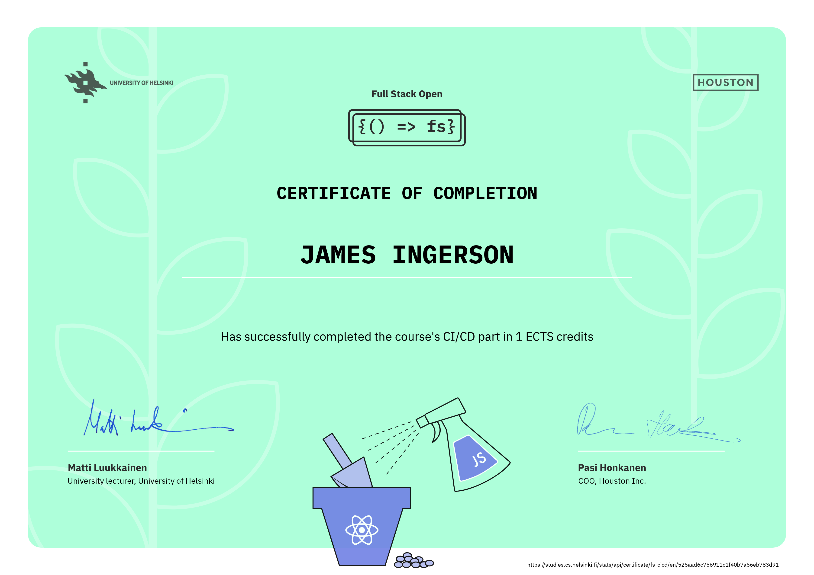

# [Full Stack Open 2022](https://fullstackopen.com/en/)

Learning React, Redux, Node.js, MongoDB, GraphQL, TypeScript, React Native, GitHub Actions, Docker, and PostgreSQL.

## [Part 11 - CI/CD](https://fullstackopen.com/en/part11)

a. [Introduction to CI/CD](https://fullstackopen.com/en/part11/introduction_to_ci_cd)  
b. [Getting started with GitHub Actions](https://fullstackopen.com/en/part11/getting_started_with_git_hub_actions)  
c. [Deployment](https://fullstackopen.com/en/part11/deployment)  
d. [Keeping green](https://fullstackopen.com/en/part11/keeping_green)  
e. [Expanding Further](https://fullstackopen.com/en/part11/expanding_further)

## Module Certificate

  

